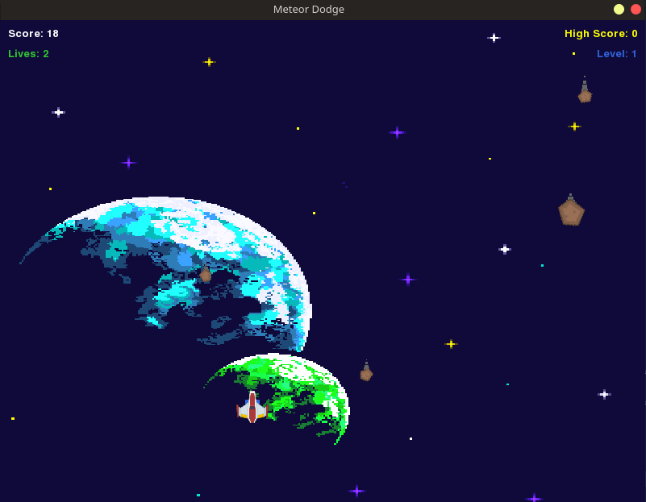
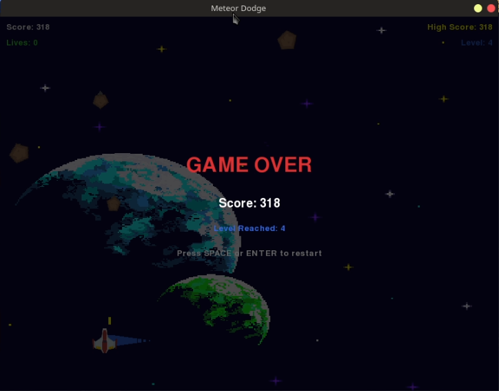
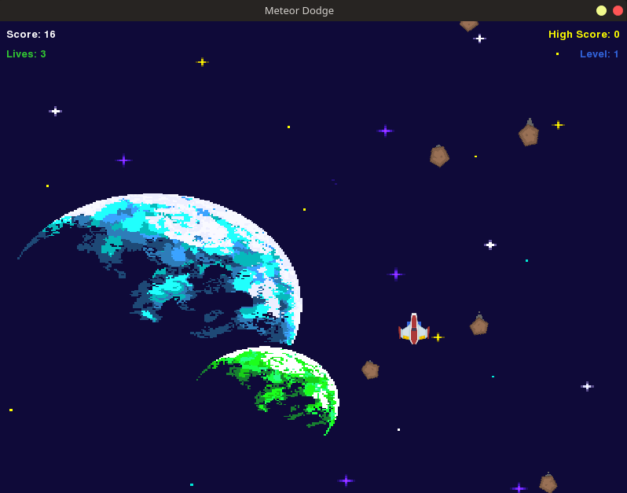

# Meteor Dodge

A survival game built with **pygame** (a library for creating games in Python). The player controls a ship that must dodge and destroy meteors falling from the sky. It has 5 levels, each with different difficulty, visual background, and weapon type.

## Requirements

- Python 3.7+
- pygame

## Installation

### Linux / macOS

```bash
# Clone the repository
git clone https://github.com/oramirez13/meteor_dodge.git
cd meteor_dodge

# Create and activate a virtual environment
python3 -m venv .venv
source .venv/bin/activate

# Install dependencies
pip install -r requirements.txt
```

### Windows 10 / 11 (PowerShell or CMD)

```cmd
REM 1. Install Python from https://www.python.org/downloads/
REM    (check "Add Python to PATH" during installation)

REM 2. Open CMD or PowerShell and run:
git clone https://github.com/oramirez13/meteor_dodge.git
cd meteor_dodge
pip install -r requirements.txt
```

## Usage

### Linux / macOS

```bash
python meteor_dodge.py
```

### Windows

```cmd
python meteor_dodge.py
```

When you are done playing, deactivate the virtual environment:

```bash
deactivate
```

## Controls

| Input             | Action                  |
| ----------------- | ----------------------- |
| Arrow keys / WASD | Move the player ship    |
| SPACE             | Shoot at meteors        |
| P                 | Pause / Resume game     |
| ESC               | Quit game               |
| SPACE / ENTER     | Restart after game over |

## Level System

The game has **5 levels**. To advance to the next level you must meet **two conditions**:

1. Reach the required score for the current level
2. Survive for at least 60 seconds in the current level

| Level | Name      | Meteor Speed | Ammo Type             | Score to Advance |
| ----- | --------- | ------------ | --------------------- | ---------------- |
| 1     | Nebula    | 3 - 5        | Normal (1 bullet)     | 50               |
| 2     | Storm     | 4 - 7        | Double (2 bullets)    | 150              |
| 3     | Belt      | 5 - 9        | Spread (3 bullets)    | 300              |
| 4     | Supernova | 6 - 11       | Rapid (fast cooldown) | 500              |
| 5     | Warzone   | 4 - 8        | Spread (3 bullets)    | Endless          |

Each level has its own background image. Level 5 introduces **enemy ships** that move, dodge, and shoot back at you.

## Features

- 5 unique levels with different backgrounds
- 4 ammo types that change per level:
  - **Normal**: single bullet straight up
  - **Double**: two parallel bullets
  - **Spread**: three bullets in a fan pattern
  - **Rapid**: single bullet with very fast fire rate
- Enemy ships in level 5 that shoot projectiles at the player
- Progress bar showing advancement toward the next level
- Level notification when advancing
- Keyboard-controlled player (arrows/WASD) with trail effect
- Destroy meteors for bonus points (15 pts vs 5 pts for dodging)
- Score tracking with high score
- Lives system (3 lives)
- Invincibility frames after being hit
- Pause/Resume with P key
- Particle explosion effects

## How It Works

1. Move your ship with arrow keys or WASD to dodge falling meteors
2. Press SPACE to shoot and destroy meteors for bonus points
3. Fill the progress bar by earning score AND surviving 60 seconds per level
4. When both conditions are met, advance to the next level with a new background and weapon
5. Survive the Warzone (level 5) against enemy ships
6. Game ends when all 3 lives are lost

## Packaging with PyInstaller

The game can be distributed as a standalone executable so the user can play it without installing Python or pygame.

### Linux / macOS

```bash
# Install PyInstaller inside the virtual environment
source .venv/bin/activate
pip install pyinstaller

# Build the executable (single file)
pyinstaller --onefile --windowed --name "MeteorDodge" --add-data "assets:assets" meteor_dodge.py

# The executable is at: dist/MeteorDodge (73 MB on Linux)
```

### Windows (PowerShell or CMD)

```cmd
REM Install PyInstaller
pip install pyinstaller

REM Build the executable (note: Windows uses ; instead of :)
pyinstaller --onefile --windowed --name "MeteorDodge" --add-data "assets;assets" meteor_dodge.py

REM The executable is at: dist\MeteorDodge.exe
```

### How to share

1. Zip the executable from `dist/`
2. Send it to your friends
3. They just unzip and double-click to run (no Python or pygame needed)

## Online Scoreboard (Laravel Site)

The game can submit scores to an online leaderboard. The site is built with **Laravel** and connects to a **MySQL** database.

### Requirements

- PHP 8.4+
- Composer
- MySQL / MariaDB

### Setup

```bash
cd /opt/lampp/htdocs/meteor_dodge_site
cp .env.example .env
# Edit .env: set DB_DATABASE, DB_USERNAME, DB_PASSWORD
php artisan migrate
php artisan serve
```

The site will be available at `http://localhost:8000`.

### API Endpoints

| Method | URL            | Description                    |
| ------ | -------------- | ------------------------------ |
| GET    | `/`            | Home page with top scores      |
| POST   | `/scores`      | Submit a new score (JSON body) |
| GET    | `/leaderboard` | Full leaderboard               |

### Submit a score from the game

The game already sends your score automatically when it ends. The JSON payload looks like:

```json
{
  "player_name": "Player",
  "score": 1500,
  "level_reached": 3,
  "time_survived": 120
}
```

## Screenshots





## Project Structure

```
meteor_dodge/
├── meteor_dodge.py          # Main game
├── assets/images/           # Game images
│   ├── background_01.png    # Level 1 background
│   ├── background_02.png    # Level 2 background
│   ├── background_03.png    # Level 3 background
│   ├── background_04.png    # Level 4 background
│   ├── background_05.png    # Level 5 background
│   ├── player.png           # Player ship
│   └── meteor.png           # Meteor sprite
├── screenshots/             # Example screenshots
│   ├── meteor_dodge_01.png
│   └── meteor_dodge_02.png
├── DOCUMENTATION.md         # Detailed code documentation (English)
├── INTERMEDIATE_CONCEPTS.md # Explains intermediate Python concepts used in the code
├── requirements.txt         # Dependencies
├── MeteorDodge.spec         # PyInstaller spec file (generated)
├── build/                   # PyInstaller build cache (can be deleted)
├── dist/                    # Standalone executable output
│   └── MeteorDodge          # The compiled game (73 MB)
├── STEP-BYSTEP.md           # Step by step guide to install and play
├── .gitignore               # Excludes cache and venv
└── README.md                # This file

meteor_dodge_site/           # Laravel web application
├── app/Http/Controllers/    # ScoreController (store, index, leaderboard)
├── app/Models/              # Score model
├── database/migrations/     # scores table migration
├── resources/views/         # Blade templates (home, leaderboard)
├── routes/web.php           # Route definitions
└── .env                     # Database configuration
```
