# Screenshots

Gallery of the game screens, in order of how they appear when playing.

## Main Menu

Main menu: the game title with shadow and outline, plus the character and ship selection screens. Use the arrow keys to navigate and ENTER to start.

## Pause Screen - Level 1 (Nebula)

Pause screen during Level 1 (Nebula). A dark overlay appears with the "PAUSED" message and the hint "Press P to continue".

## Game Over

Game over screen: "GAME OVER" in red with the final score, the level reached, and the hint to press SPACE or ENTER to return to the menu.

## Gameplay - Level 2 (Storm)

Gameplay of Level 2 (Storm). The ship dodges and shoots falling meteors while the HUD shows score, lives, and weapon.

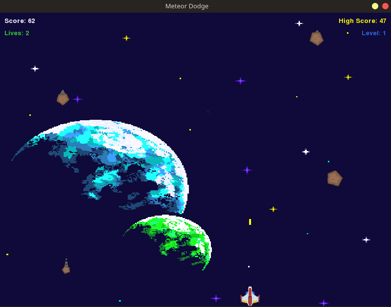

## Gameplay - Level 3 (Belt) - Spread

Gameplay of Level 3 (Belt). The weapon is now "Spread", which fires three bullets in a fan pattern.

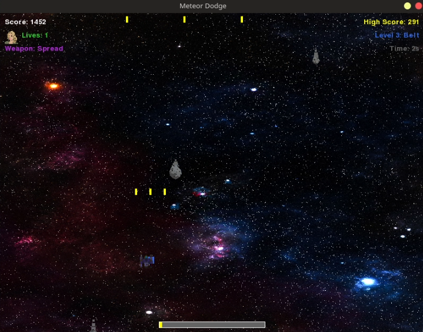

## Level Complete - Level 4 (Supernova)

Level complete notification in Level 4 (Supernova). The "LEVEL COMPLETE" message appears when the level conditions are met.

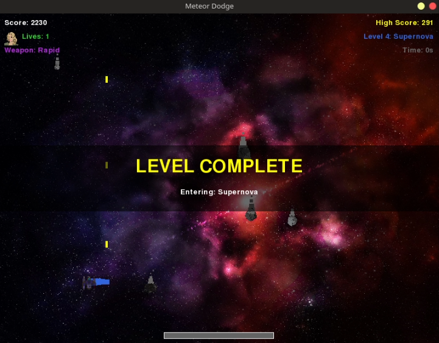

## Gameplay - Level 4 (Supernova) - Rapid Fire

Gameplay of Level 4 (Supernova) with its reddish background and the rapid-fire weapon.

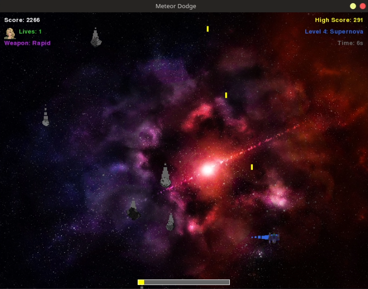

## Gameplay - Level 5 (Warzone) - Enemy Ships

Gameplay of Level 5 (Warzone). This level adds enemy ships that move, dodge, and shoot back at the player.

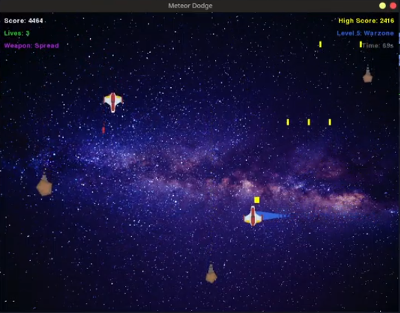

## Pause Screen - Level 4 (Supernova)

Pause screen during Level 4 (Supernova): the dark overlay with the "PAUSED" message over the level background.

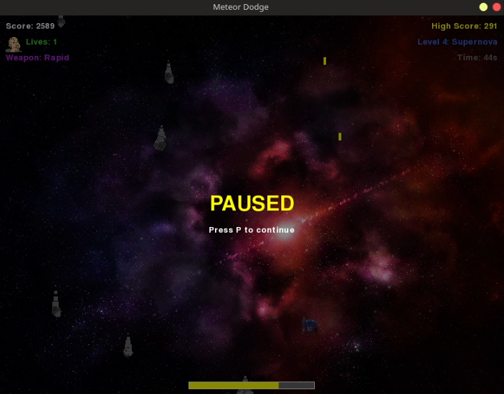

## Level Complete - Entering Level 5 (Warzone)

Level complete notification when entering Level 5 (Warzone). The "LEVEL COMPLETE / Entering: Warzone" message shows the transition to the last level.

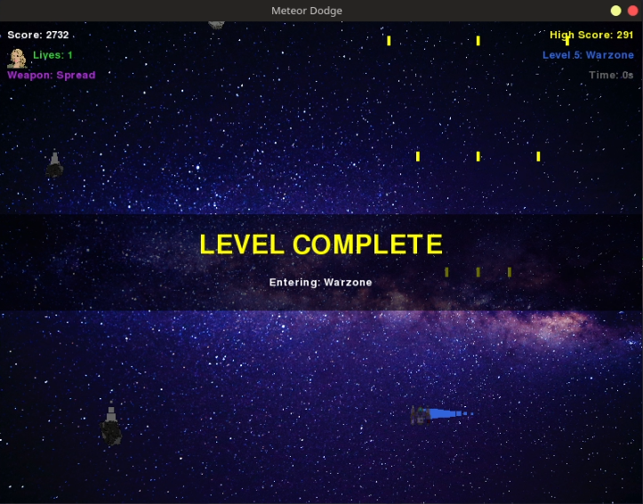

## Gameplay - Level 5 (Warzone)

Gameplay of Level 5 (Warzone). The HUD shows the score, lives, and the current level.

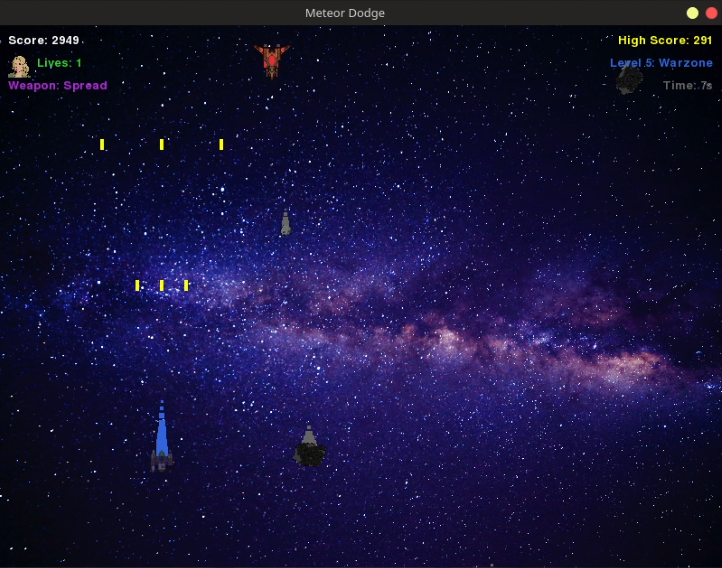

## Gameplay - Level 5 (Warzone) - Spread Weapon

Gameplay of Level 5 (Warzone) with the Spread weapon and the level timer in the HUD.

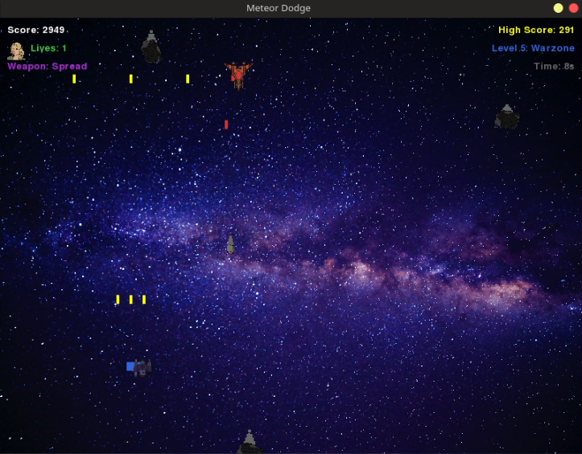

## Gameplay - Level 5 (Warzone) - High Score

Gameplay of Level 5 (Warzone) at a higher score, dodging meteors and enemy ships.

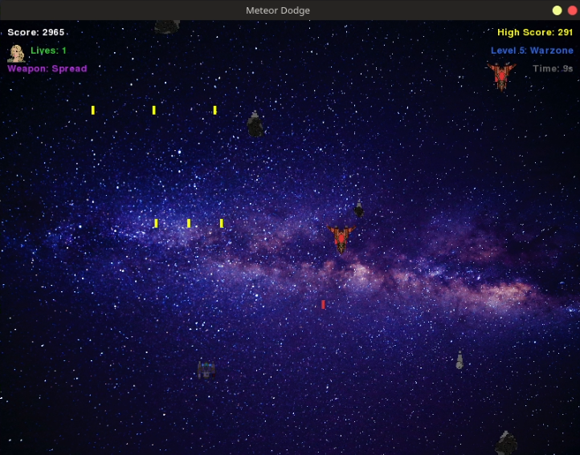

## Gameplay - Level 5 (Warzone) - Heavy Action

Gameplay of Level 5 (Warzone) with several meteors and enemy ships on screen.

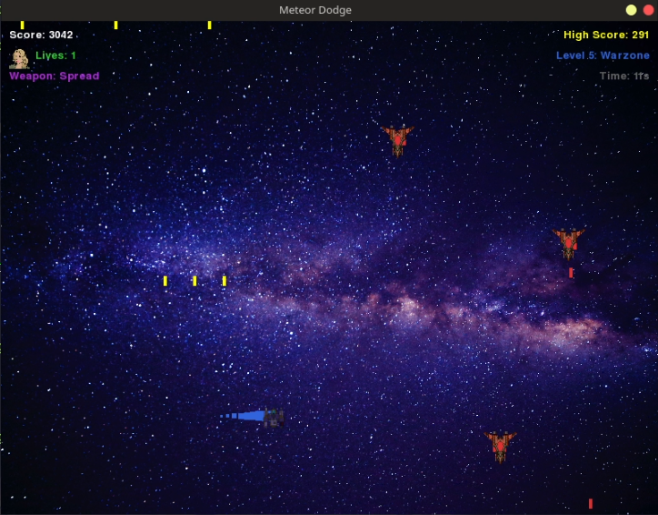

## Game Over - New High Score

Game over screen after a long run: "GAME OVER" with the final score and the new high score reached (3685).

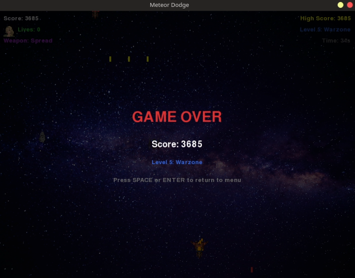
